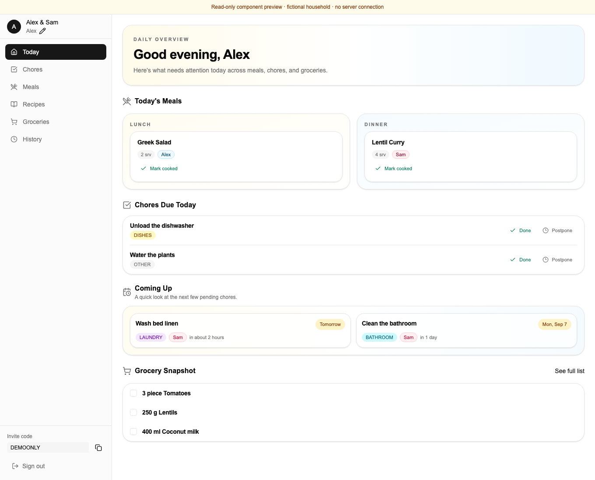
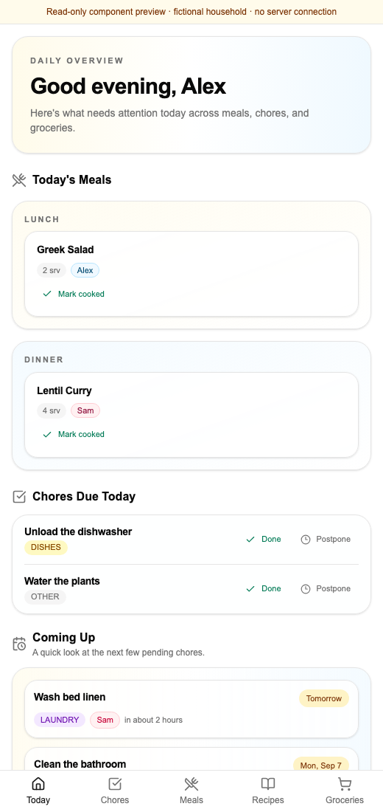

# Chore Diary walkthrough

[Back to overview](../README.md)

## Preview without accounts or credentials

```bash
npm ci
npm run preview:ui
```

Open http://127.0.0.1:4173. This isolated, read-only component preview renders
the actual Today page, sidebar, bottom navigation, meal cards, chore rows, and
grocery snapshot with fictional Alex/Sam fixtures. It does not load `.env`
files, connect to a database, or contact Clerk. Navigation and writes are
disabled; it is not a full application demo or an authorization test.

The preview lives under `tools/preview`, outside Next.js routes. Its aliases
replace data/auth imports and reject action calls. Production configuration
does not use these aliases. The preview uses a local system font instead of
Next.js's downloaded font.

## A two-minute product tour

1. **Today:** see lunch and dinner, assignees, serving counts, and due chores
   together. The screenshot shows two household members sharing their plans.
2. **Coming Up:** inspect the next chores and who is assigned to them.
3. **Grocery Snapshot:** see ingredients needed for the planned meals.
4. Narrow the window below 768px to see stacked cards and bottom navigation.





## Full interactive workflow

For real writes, follow [local setup](LOCAL_DEVELOPMENT.md), using a disposable
database and a development Clerk application. Sign in, create a household,
add a recurring chore, add a recipe, schedule that recipe in Meals, and generate
the groceries. Complete the chore and inspect History. The component preview
does not exercise those backend operations.

## Capture provenance

Captured September 2026 from the read-only preview in Chrome at 1360px and
520px viewport widths. All names, invitation codes, meals, and chores are
synthetic. Refreshing the preview derives due dates from the current date.
Review each new capture for clipping and private data before committing it.
